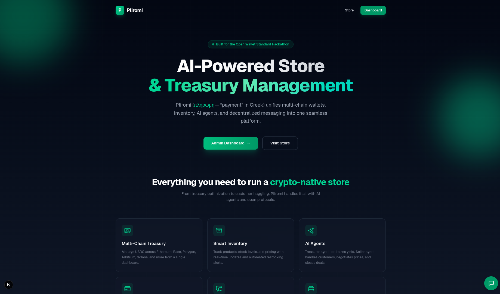
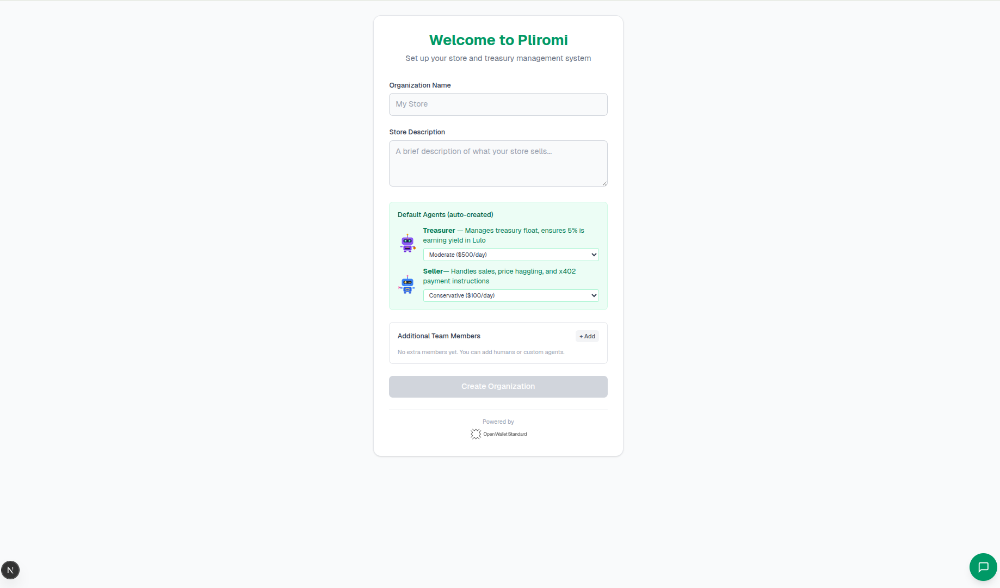
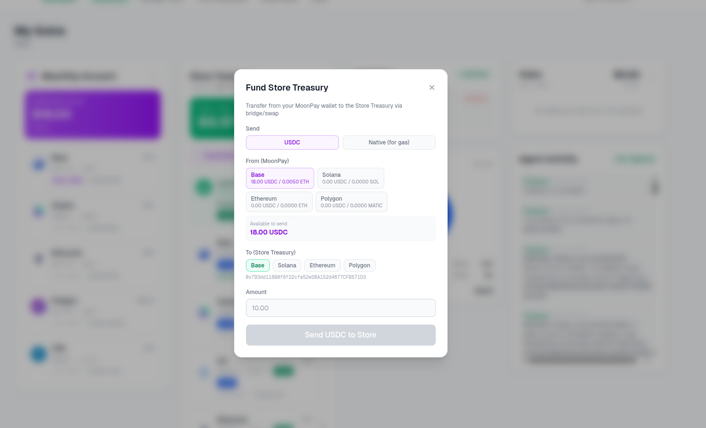
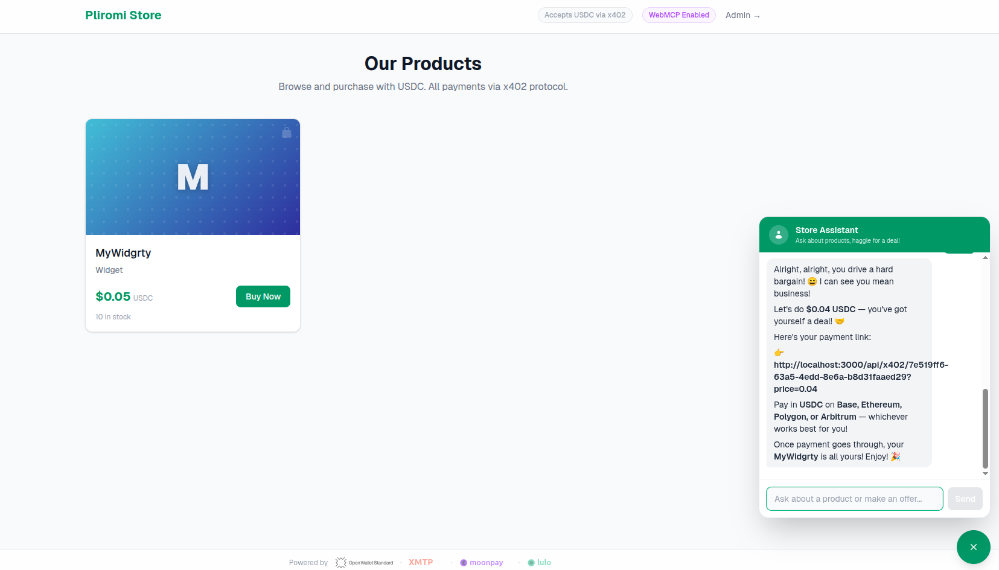
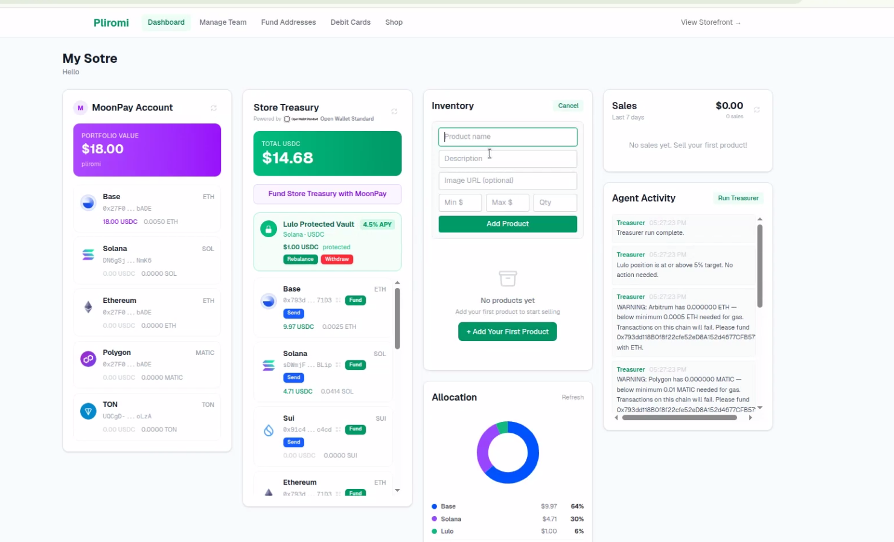

# Pliromi

**AI-Powered Store & Treasury Management on the Open Wallet Standard**

> *Pliromi* (Greek: payment) is a full-stack store and treasury management system where AI agents and humans collaborate to run a business — managing multi-chain wallets, selling products, haggling prices, farming yield, and accepting crypto payments — all built on [OWS](https://openwallet.sh), [x402](https://www.x402.org/), [XMTP](https://xmtp.org), [MoonPay](https://moonpay.com), and [Lulo Finance](https://lulo.fi).



---


## The Problem

Running a crypto-native store today means juggling multiple wallets, manually monitoring balances across chains, setting up payment infrastructure, and coordinating between team members. There's no unified system that combines treasury management, inventory, AI agents, and crypto payments into a single experience — and certainly nothing an AI agent can interact with natively.

## The Solution

Pliromi brings everything together:

- **One wallet, every chain** — OWS manages keys for 11+ blockchains from a single encrypted vault
- **AI agents that work for you** — A Treasurer watches your float and farms yield; a Seller negotiates prices with customers
- **Pay with a URL** — x402 protocol turns every product into a payable endpoint
- **Any agent can shop here** — The store is a WebMCP server that browser AI agents and CLI tools can interact with directly
- **Team coordination** — XMTP group chat keeps humans and agents in sync with policy-governed spending limits
- **On/off ramp and bridging/swap** - Moonpay does it all using their CLI. Fast, easy and safely

---

## Architecture

```
                    ┌──────────────────────────────────────────┐
                    │            Admin Dashboard               │
                    │  Treasury | Inventory | Chat | Activity  │
                    └─────────────────┬────────────────────────┘
                                      │
          ┌───────────────────────────┼───────────────────────────┐
          │                           │                           │
   ┌──────▼──────┐           ┌───────▼────────┐          ┌──────▼──────┐
   │  Treasurer  │           │  OWS Wallet    │          │   Seller    │
   │   Agent     │           │  "hackathon"   │          │   Agent     │
   │             │           │                │          │             │
   │ - Float mgmt│           │ 11+ chains     │          │ - Haggling  │
   │ - Lulo yield│           │ Policy engine  │          │ - x402 URLs │
   │ - Relay     │           │ API keys       │          │ - Claude AI │
   │   bridging  │           │                │          │             │
   └──────┬──────┘           └───────┬────────┘          └──────┬──────┘
          │                          │                          │
          └──────────────────────────┼──────────────────────────┘
                                     │
                    ┌────────────────▼─────────────────┐
                    │        Public Storefront          │
                    │   WebMCP + x402 + Seller Chat     │
                    │                                   │
                    │  Browser agents: registerTool()   │
                    │  CLI agents: /store/mcp            │
                    │  Humans: Chat + Buy Now            │
                    └───────────────────────────────────┘
```

---

## Key Features

### Multi-Chain Treasury (OWS)
- Wallet "hackathon" with derived addresses on Ethereum, Base, Polygon, Arbitrum, Solana, Bitcoin, Cosmos, Tron, TON, Sui, and Filecoin
- Real-time USDC + native token balances across all chains
- Policy engine: per-member spending limits (max/tx, daily cap, chain restrictions)
- Team API keys with configurable policies — agents and humans each get scoped access
- QR codes and copy-to-clipboard for every address

### AI Agents
- **Treasurer** — Runs every 5 minutes. Checks total USDC float, targets a configurable percentage in Lulo yield farming (Solana). Bridges USDC from EVM chains via Relay when Solana balance is insufficient. Monitors gas levels. Posts treasury reports to XMTP group chat.
- **Seller** — Powered by Claude (claude-sonnet-4-6). Negotiates prices with customers (starts at max, never below min). Returns full x402 payment URLs with negotiated `?price=` parameter. Logs deals to XMTP group.

### x402 Payments
- Every product is a payable URL: `GET /api/x402/{productId}` returns `402 Payment Required` with USDC payment details
- Supports negotiated prices via `?price=` query parameter
- Accepts `X-PAYMENT` header for direct agent-to-agent payment flow
- Multi-chain: Base, Ethereum, Polygon, Arbitrum
- CLI payment: `ows pay request --wallet myWallet "http://store/api/x402/{id}"`

### WebMCP (Chrome 146+)
The store is a **WebMCP server** — AI agents browsing the site in Chrome can discover and invoke tools directly:

**Imperative tools** (via `navigator.modelContext.registerTool`):
- `list_products` — Browse all products with prices, stock, and x402 payment links
- `get_payment_link` — Get the full x402 URL for any product, with optional negotiated price
- `negotiate_price` — Chat with the seller agent to haggle for a better deal

**Declarative tools** (via HTML form annotations):
- Each product card has a `<form toolname="buy_...">` that browser agents can invoke

**Server-side MCP** at `/store/mcp` for CLI-based agents.

### XMTP Team Chat
- Browser wallet login (MetaMask/Rabby) creates an XMTP group chat
- Slash commands: `/treasurer status`, `/seller ask about products`
- Agents post activity updates (sales, treasury moves, yield deposits) to the group
- Optimistic message rendering with stream dedup

### MoonPay Integration
- **Deposits** — Create multi-chain deposit addresses that auto-convert any token to USDC (Solana, Ethereum, Bitcoin, Tron sources)
- **Commerce** — Browse Shopify stores accepting Solana Pay, search products, manage cart, checkout with crypto

### Laso Finance Debit Cards
- Order prepaid debit cards ($5–$500+) paid via x402
- Assign cards to team members or agents
- Visual card UI with masked/revealable card numbers, expiry, CVV
- Revoke cards instantly

### Lulo DeFi Yield
- Treasurer agent deposits USDC to Lulo's protected vault on Solana
- Configurable allocation percentage via `LULO_ALLOCATION_PCT` env var
- Live APY and balance tracking on the dashboard
- Auto-bridges from EVM chains when Solana USDC is insufficient

---

## Tech Stack

| Layer | Technology |
|-------|-----------|
| **Wallet** | [Open Wallet Standard](https://openwallet.sh) — multi-chain key management, policy engine |
| **Payments** | [x402 Protocol](https://www.x402.org/) — HTTP 402 Payment Required |
| **Messaging** | [XMTP](https://xmtp.org) — decentralized group chat |
| **On-ramp** | [MoonPay](https://moonpay.com) — deposits, commerce, Shopify |
| **DeFi** | [Lulo Finance](https://lulo.fi) — USDC yield farming on Solana |
| **Cards** | [Laso Finance](https://laso.finance) — prepaid debit cards |
| **Bridging** | [Relay](https://relay.link) — cross-chain USDC transfers |
| **AI** | [Claude](https://anthropic.com) (claude-sonnet-4-6) — seller agent |
| **Agent Protocol** | [WebMCP](https://developer.chrome.com/docs/ai/webmcp) — browser-native tool registration |
| **Frontend** | Next.js 16, React 19, Tailwind CSS 4 |
| **Storage** | JSON file database with in-memory cache |

---

## Getting Started

### Prerequisites
- Node.js 22+
- OWS CLI (`ows`) installed
- MoonPay CLI (`mp`) installed
- Chrome 146+ with `chrome://flags/#enable-webmcp-testing` (for WebMCP)

### Setup

```bash
# Clone and install
cd pliromi
npm install

# Configure environment
cp .env.example .env
# Fill in: ANTHROPIC_API_KEY, LULO_API_KEY, INFURA_RPC_API_KEY, ETHERSCAN_API_KEY

# Create OWS wallet (if first time)
ows wallet create --name hackathon

# Start dev server
npm run dev
```

### Usage

1. **Visit** `http://localhost:3000` — Landing page with overview
2. **Onboard** at `/onboarding` — Create your org, configure agent policies
3. **Dashboard** at `/dashboard` — View treasury, manage inventory, chat with team
4. **Store** at `/store` — Public storefront where customers (human or AI) shop
5. **WebMCP** — Open store in Chrome 146+ with the flag enabled, use the Model Context Tool Inspector extension to see registered tools

---

## Demo Flow

1. **Create org** → "My Store" with Treasurer (moderate policy) + Seller (conservative policy)



2. **Add product** → "Widget" priced $1–$5 USDC, qty 10
3. **Fund treasury** → Use MoonPay deposit to get USDC on Base


4. **Customer visits store** → Chats with seller: "Can I get the Widget for $2?"
5. **Seller negotiates** → "How about $3?" → Customer: "$2.50?" → "Deal! Here's your payment link"

6. **Payment** → Customer pays $2.50 USDC via x402 on Base
7. **Treasurer runs** → Sees $2.50 income, deposits 1% to Lulo yield on Solana


8. **AI agent shops** → Another Claude instance discovers the store via WebMCP, lists products, negotiates, and pays via `ows pay request`

---

## Project Structure

```
pliromi/
├── app/
│   ├── (admin)/          # Dashboard, team, fund, debit-card, commerce
│   ├── (store)/          # Public store + WebMCP
│   ├── api/              # REST + MCP endpoints
│   ├── onboarding/       # Standalone onboarding
│   └── .well-known/      # WebMCP discovery
├── components/           # React components
├── lib/
│   ├── agents/           # Treasurer + Seller agent logic
│   ├── db.ts             # JSON database with mtime cache
│   ├── wallet.ts         # OWS wallet integration
│   ├── relay.ts          # Relay bridge helper
│   ├── mcp-server.ts     # MCP server (tools)
│   └── xmtp*.ts          # XMTP helpers
├── public/               # Logos, assets
├── data/store.json       # Runtime database
└── webmcp.d.ts           # WebMCP TypeScript types
```

---

## Sponsor Integration Summary

| Sponsor | Integration |
|---------|------------|
| **OWS** | Core wallet infrastructure — key management, multi-chain derivation, policy engine, API keys, transaction signing for all payment flows |
| **XMTP** | Team communication — group chat between humans and AI agents, slash commands, real-time activity feed |
| **MoonPay** | Deposits (auto-convert to USDC), Shopify commerce (browse + Solana Pay checkout) |
| **Lulo** | DeFi yield — Treasurer agent auto-deposits configurable % of USDC float to protected vault |
| **Laso** | Prepaid debit cards — ordered and paid via x402, assigned to team members/agents |
| **Relay** | Cross-chain USDC bridging — Treasurer bridges from EVM chains to Solana for Lulo deposits |

---

## License

Built for the [OWS Hackathon](https://hackathon.openwallet.sh).


Demos: 


